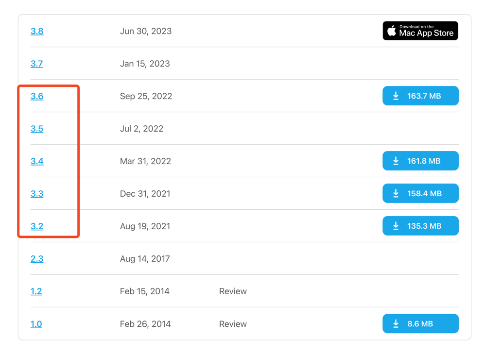

# 微信数据库破解

## 环境配置

- 微信
  - 版本要求： 3.6以下都可以，3.8以上不可以（使用了多进程以及其他技术，目前的 dtrace 脚本无效）
  - 下载地址：https://macdownload.informer.com/wechat/versions/
  - 

## 参考

- 核心破解参考： nalzok/wechat-decipher-macos: DTrace scripts to extract chat history from WeChat on macOS, https://github.com/nalzok/wechat-decipher-macos/tree/main
- D 语言：The D Programming Language, https://docs.oracle.com/en/operating-systems/oracle-linux/dtrace-guide/dtrace-ref-TheDProgrammingLanguage.html#dt_dlang
- 
